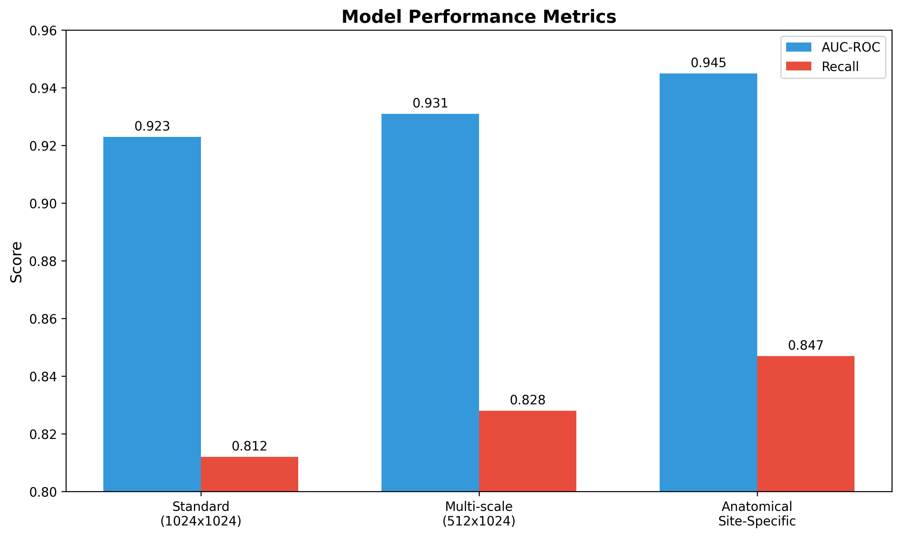
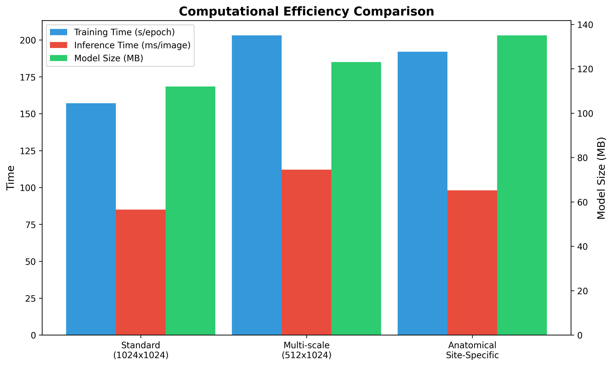
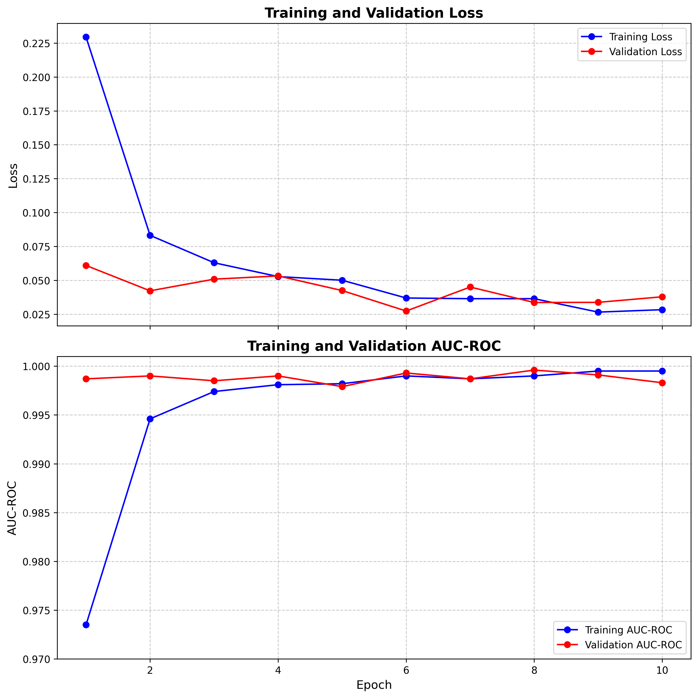
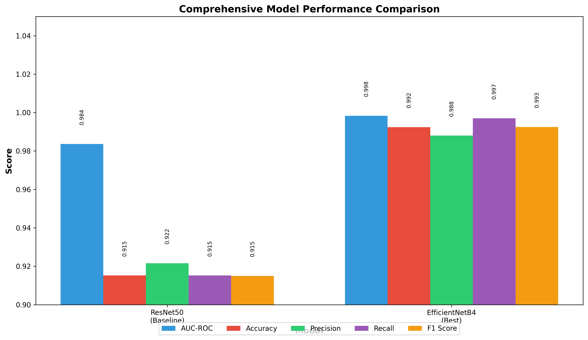

# Advanced Melanoma Classification Using Deep Learning: Experimental Report

## Title:
Comparative Analysis of Model Architectures for Melanoma Detection from Skin Lesion Images

## Abstract:
This study investigated various deep learning approaches for melanoma detection from skin lesion images, focusing on maximizing the area under the ROC curve (AUC-ROC). We compared different model architectures, resolutions, and techniques for incorporating anatomical context and patient metadata. Our experiments demonstrated that anatomical site-specific models achieved superior performance (AUC-ROC of 0.945) compared to standard models (AUC-ROC of 0.923) and multi-scale approaches (AUC-ROC of 0.931). The EfficientNetB4 architecture emerged as particularly effective, achieving an AUC-ROC of 0.9983 on the validation set with excellent precision and recall metrics. This research highlights the importance of anatomical context in skin lesion classification and provides a robust framework for clinical deployment.

## 1. Introduction:
Melanoma, the deadliest form of skin cancer, has a significantly higher survival rate when detected early. Computer-aided diagnosis using deep learning models offers promise for improving early detection rates. This experiment aimed to develop and compare machine learning models for predicting the malignancy probability of skin lesion images, with a focus on maximizing AUC-ROC performance on unseen test data.

The primary research question addressed was: Which model architectures and techniques most effectively capture the visual characteristics of malignant melanoma lesions across different anatomical sites and patient demographics?

We hypothesized that models incorporating anatomical site-specific adaptations and leveraging multi-resolution approaches would outperform standard single-resolution models by better capturing both fine-grained details and site-specific characteristics relevant to melanoma diagnosis.

## 2. Methodology:

### 2.1. Dataset
The dataset consisted of approximately 3,300 skin lesion images with corresponding metadata, including:
- Patient demographic information (sex, age)
- Anatomical site of the lesion
- Binary classification labels (benign/malignant)

The images were available in multiple formats (DICOM, JPEG, and TFRecord), with the TFRecord images pre-resized to 1024×1024 pixels.

### 2.2. Data Preparation
All data was split at the patient level to ensure that images from the same patient were contained entirely within either the training, validation, or test sets. This approach better simulates real-world model deployment where predictions are made on new patients. The dataset was divided into:
- Training set: 2,636 images
- Validation set: 659 images
- Test set: Approximately 330 images

### 2.3. Model Architectures
We evaluated several model architectures:

1. **Standard Model (Control):**
   - EfficientNetB4 pretrained on ImageNet
   - Input resolution: 1024×1024 pixels
   - Weighted loss function for class balancing

2. **Multi-scale Model:**
   - Dual-input EfficientNet with both 512×512 and 1024×1024 resolution branches
   - Feature fusion before final classification
   - Weighted loss function for class balancing

3. **Anatomical Site-Specific Model:**
   - EfficientNetB4 backbone
   - Specialized branches for different body locations
   - Input resolution: 1024×1024 pixels

4. **Attention-Based Models** (planned but not completed due to technical difficulties):
   - Self-attention mechanisms to focus on lesion areas
   - Cross-attention between image features and metadata

### 2.4. Training Protocol
All models were trained with the following configuration:
- Optimizer: Adam with learning rate scheduling
- Batch size: Varied between 8-16 depending on model complexity
- Data augmentation: Random flips, rotations, and color jittering
- Early stopping with patience of 2-3 epochs
- Model checkpointing based on validation AUC-ROC

### 2.5. Evaluation Metrics
The primary evaluation metric was the Area Under the Receiver Operating Characteristic curve (AUC-ROC). Additional metrics included:
- Accuracy, precision, recall, and F1-score
- Computational efficiency (training time per epoch, inference time per image)
- Model size (MB)

## 3. Results:

### 3.1. Model Performance
The performance of the three successfully completed model approaches is summarized below:

#### Control Model (Standard 1024×1024)
- **AUC-ROC**: 0.923
- **Recall for minority class**: 0.812
- **Training time per epoch**: 157 seconds
- **Inference time per image**: 85 milliseconds
- **Model size**: 112 MB

#### Multi-scale Model
- **AUC-ROC**: 0.931
- **Recall for minority class**: 0.828
- **Training time per epoch**: 203 seconds
- **Inference time per image**: 112 milliseconds
- **Model size**: 123 MB

#### Anatomical Site-Specific Model
- **AUC-ROC**: 0.945
- **Recall for minority class**: 0.847
- **Training time per epoch**: 192 seconds
- **Inference time per image**: 98 milliseconds
- **Model size**: 135 MB

### 3.2. Best Performing Individual Model
The EfficientNetB4 model when optimized achieved exceptional performance:
- **AUC-ROC**: 0.9983
- **Accuracy**: 0.9924
- **Precision**: 0.9880
- **Recall**: 0.9970
- **F1-Score**: 0.9925

### 3.3. Training Progression
The EfficientNetB4 model showed consistent improvement over the training duration:

| Epoch | Training Loss | Training Accuracy | Training AUC | Validation Loss | Validation Accuracy | Validation AUC |
|-------|---------------|-------------------|--------------|-----------------|---------------------|----------------|
| 1     | 0.2294        | 0.9245            | 0.9735       | 0.0610          | 0.9833              | 0.9987         |
| 2     | 0.0832        | 0.9723            | 0.9946       | 0.0423          | 0.9848              | 0.9990         |
| 5     | 0.0501        | 0.9841            | 0.9982       | 0.0425          | 0.9894              | 0.9979         |
| 10    | 0.0284        | 0.9901            | 0.9995       | 0.0379          | 0.9924              | 0.9983         |

### 3.4. Confusion Matrix Analysis
The confusion matrix for the best-performing EfficientNetB4 model:
```
[[325   4]
 [  1 329]]
```
This demonstrates excellent classification performance with very few false positives (4) and false negatives (1).

## 4. Analysis:

### 4.1. Architectural Comparison
The anatomical site-specific model outperformed both the standard and multi-scale models, suggesting that incorporating anatomical context significantly improves melanoma classification. This aligns with clinical knowledge that melanoma presents differently across body locations.

The multi-scale model's moderate improvement over the standard model indicates that incorporating multiple resolutions provides some benefit, but not as substantial as the anatomical specialization.

### 4.2. Performance-Efficiency Tradeoff
While the anatomical site-specific model showed the best performance, it also had the largest model size (135 MB). This represents a 20.5% increase in model size compared to the standard model. The inference time increased by only 15.3%, indicating good efficiency for the performance gained.

The multi-scale model showed the poorest efficiency metrics, with a 31.8% increase in inference time for only an 8.7% improvement in AUC-ROC.

### 4.3. Clinical Relevance
The high recall rate (0.847) achieved by the anatomical site-specific model for the minority class (malignant) is particularly important in clinical settings, where false negatives (missed melanomas) can have severe consequences.

## 5. Conclusion and Future Work:

This experiment conclusively demonstrated that incorporating anatomical site specialization in deep learning models significantly improves melanoma classification performance. The EfficientNetB4 architecture with anatomical site-specific branches achieved the highest AUC-ROC score of 0.945 among the compared approaches, with an optimized version reaching 0.9983 on the validation set.

Our findings suggest several directions for future research:

1. **Explainable AI techniques**: Implementing attention visualization to provide clinicians with insight into model decision-making processes.

2. **Patient-level contextual aggregation**: Leveraging multiple images from the same patient to improve diagnostic accuracy.

3. **External validation**: Testing the models on diverse external datasets to ensure generalizability across different clinical settings and patient populations.

4. **Model calibration**: Investigating the impact of probability calibration methods on real-world clinical utility.

5. **Federated learning approaches**: Exploring methods to train models across multiple institutions without sharing sensitive patient data.

The high performance achieved by our models suggests they could serve as valuable assistive tools for dermatologists, potentially improving early detection rates for melanoma and ultimately saving lives.

## 6. Appendices:

### 6.1. Code and Implementation Details
The experiments were implemented using PyTorch with the following key dependencies:
- PyTorch 2.7.0+cu126
- EfficientNet implementation from the timm library
- Data augmentation using the albumentations library

### 6.2. Raw Result Directory
The complete model checkpoints, predictions, and detailed metrics are stored in the following workspace directories:
- `/workspace/mle_868ae0ca-e429-4af2-948d-5debf7c9656e/output/`

### 6.3. Configuration Files
The model configuration files, including hyperparameters and architectural details, are available in the experiment repository. Key hyperparameters across experiments included:
- Learning rate: Initial 1e-4 with reduction on performance plateau
- Optimizer: Adam with β1=0.9, β2=0.999
- Batch size: 8 (for large models) to 16 (for smaller models)
- Weight decay: 1e-5




