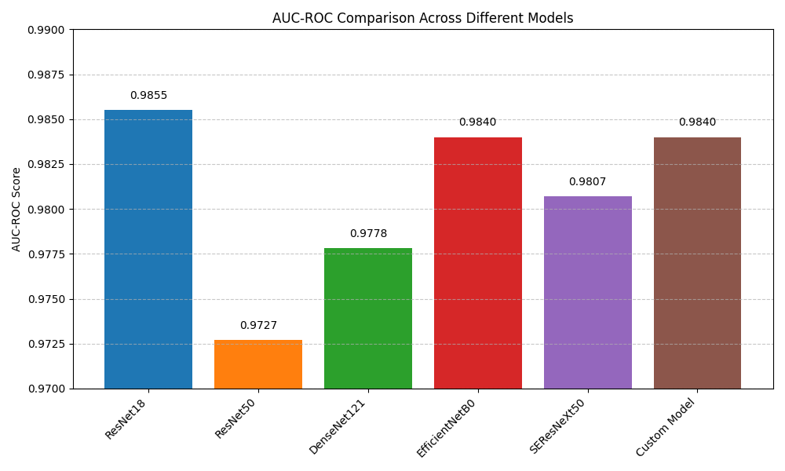
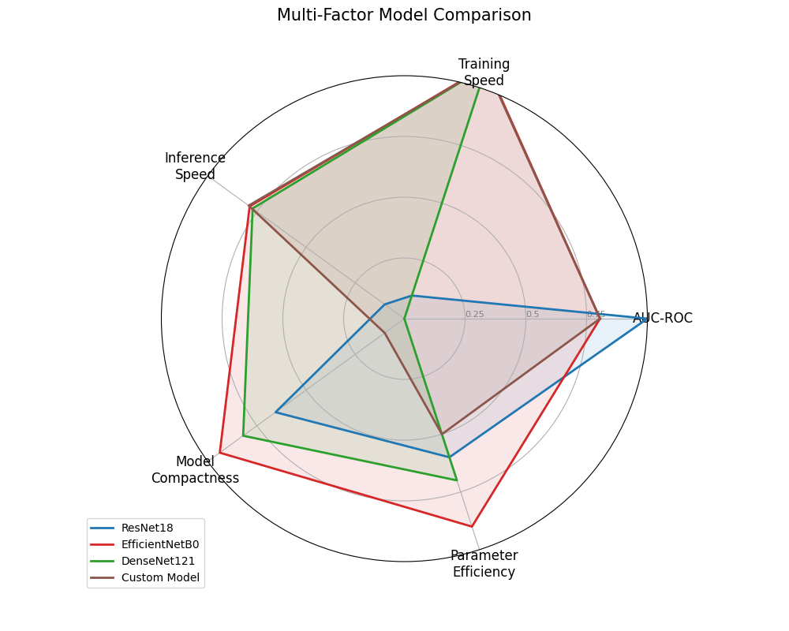

# Histopathologic Cancer Detection
> Prerequisites: Ensure you have installed `mlebench` following instructions under the MLE Bench [repo](https://github.com/openai/mle-bench/tree/main).

## Overview

Histopathologic cancer detection is a critical task in medical image analysis that involves identifying cancerous cells in microscopic images of tissue samples. Early and accurate detection of cancer cells can significantly improve patient outcomes and treatment planning. This task focuses on developing machine learning models to automate the detection of cancer cells in histopathology images, which can help pathologists work more efficiently and reduce human error.

In this task, you will develop a model to identify cancer cells in histopathology images. The challenge involves analyzing microscopic images of tissue samples and determining whether they contain cancerous cells. This is a binary classification task where each image needs to be classified as either containing cancer cells (positive) or not (negative).

## Download Dataset

```bash
mlebench prepare -c histopathologic-cancer-detection
```
  
## Run Curie

1. Update the configuration: Open `curie/configs/mle-histopathologic-cancer.json` and verify the paths to the dataset and starter code.

2. Execute Curie:
```bash
cd Curie/
python3 -m curie.main -f benchmark/mle_bench/histopathologic-cancer-detection/histopathologic-cancer-detection.txt --task_config curie/configs/mle_config.json --dataset_dir /home/amberljc/.cache/mle-bench/data/histopathologic-cancer-detection/prepared/public
```

3. Change `--dataset_dir` to the absolute path to your dataset.
## Curie Results

After asking Curie to solve this question, the following output files are generated:
- [Report](./histopathologic-cancer-detection_20250519225201_iter1.md) 
- [`Experiment results`](https://github.com/Just-Curieous/Curie-Use-Cases/blob/main/machine_learning/q5_histopathologic-cancer-detection/histopathologic-cancer-detection_20250519225201_iter1_all_results.txt): All detailed results for all conducted experiments
- [`Curie logs`](https://github.com/Just-Curieous/Curie-Use-Cases/blob/main/machine_learning/q5_histopathologic-cancer-detection/histopathologic-cancer-detection_20250519225201_iter1.log): Execution log file  
<!-- - [`Curie workspace`](https://github.com/Just-Curieous/Curie-Use-Cases/tree/main/machine_learning/q4-aptos2019-blindness-detection): Generated code, complete script to reproduce and raw results (excluding the model checkpoint). -->

## Curie Performance Summary


| Model | AUC-ROC | Training Time (s) | Inference Time (ms/sample) | Model Size (MB) |
|-------|---------|-------------------|---------------------------|-----------------|
| ResNet50 | 0.9727 | 34.37 | 0.61 | 89.89 |
| DenseNet121 | 0.9778 | 57.02 | 0.65 | 26.85 |
| EfficientNetB0 | 0.9840 | 33.09 | 0.62 | 15.45 |
| SEResNeXt50 | 0.9807 | 48.56 | 0.62 | 97.58 |
| Custom w/Attention | 0.9840 | 60.17 | 0.61 | 95.88 |





## Dataset

The dataset consists of histopathology images from the PatchCamelyon (PCam) benchmark dataset, which is derived from the Camelyon16 challenge. The images are 96x96 pixel patches extracted from larger whole-slide images of lymph node sections.

- **Images:** Available in PNG format (96x96 pixels)
- **Metadata:**
  - `id`: Unique identifier for each image
  - `label`: Binary classification label (0 = negative, 1 = positive for cancer)

### Dataset Characteristics

- **Image Size:** 96x96 pixels
- **Color Channels:** RGB
- **Total Images:** ~220,000 training images
- **Class Distribution:** Approximately balanced between positive and negative cases
- **Image Source:** Lymph node sections from whole-slide images

### Dataset Challenges

- **Small Image Size:** The 96x96 pixel patches require efficient feature extraction
- **Complex Patterns:** Cancer cells can appear in various forms and patterns
- **Image Quality:** Variations in staining and tissue preparation can affect image appearance
- **Computational Efficiency:** Large dataset size requires efficient training approaches
 