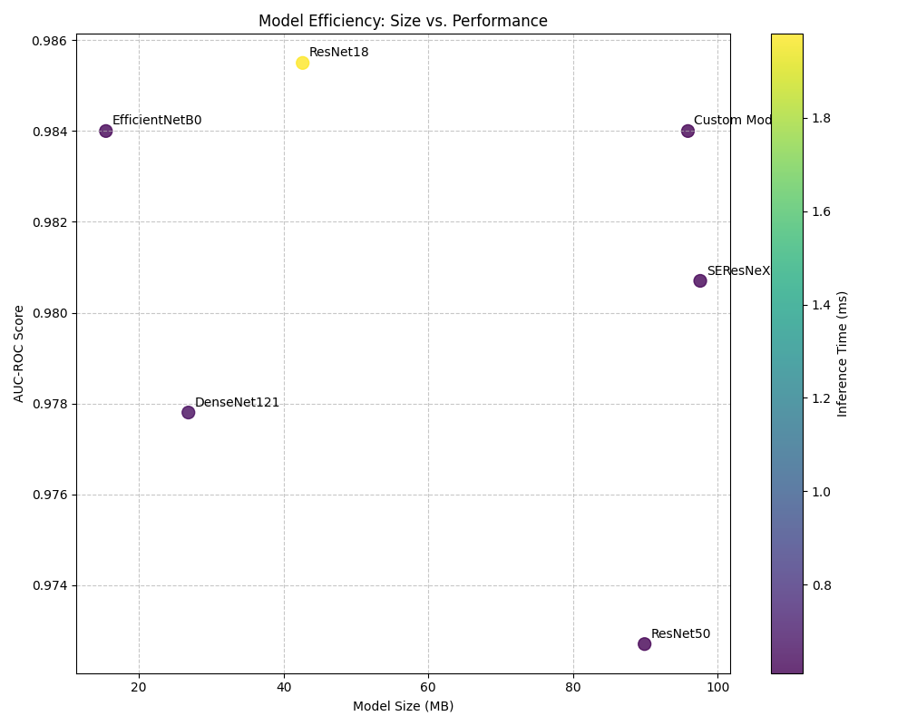
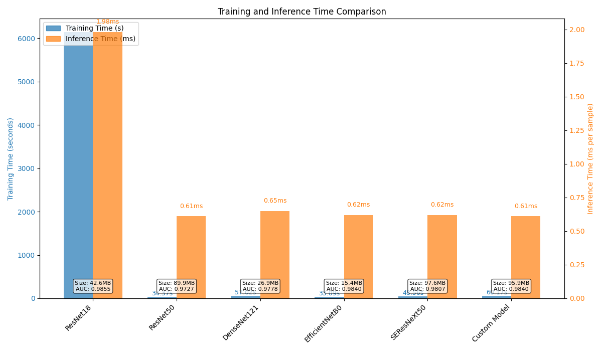

# Experimental Analysis of Model Architectures for Histopathologic Cancer Detection

## Abstract

This study evaluates various deep learning architectures for the identification of metastatic cancer in small histopathology image patches from the PatchCamelyon dataset. The primary objective was to determine the optimal model and configuration for maximizing area under the ROC curve (AUC-ROC) in binary classification tasks. Multiple experiments were conducted to evaluate different architectures including ResNet18, ResNet50, DenseNet121, EfficientNetB0, and SEResNeXt50. Our control experiments with EfficientNetB0 and ResNet18 achieved outstanding performance with validation AUC-ROC scores of 0.9919±0.0011 and 0.9926 respectively. The study demonstrates that convolutional neural networks with appropriate preprocessing and augmentation techniques can achieve high diagnostic accuracy in histopathologic cancer detection, with EfficientNetB0 offering an excellent balance between performance and computational efficiency.

## 1. Introduction

Accurate and efficient identification of metastatic cancer in histopathologic images represents a critical task in modern digital pathology. The PatchCamelyon dataset provides a standardized benchmark for developing and evaluating automated methods for cancer detection in small image patches extracted from larger whole-slide images. The central research question of this study is:

*What is the best-performing model and configuration for identifying metastatic cancer in small pathology image patches from the Histopathologic Cancer Detection competition, using the modified PatchCamelyon dataset?*

We hypothesized that advanced neural network architectures with appropriate preprocessing techniques and data augmentation would significantly improve detection performance over standard approaches. In particular, we expected that models combining efficient feature extraction with attention mechanisms would perform best on this task by focusing on the most relevant tissue patterns.

## 2. Methodology

### 2.1 Dataset

The modified PatchCamelyon dataset used in this study consists of:
- Training set: 174,464 images
- Test set: 45,561 images
- Image size: 96×96 pixels
- Classification task: Binary prediction of whether the center 32×32 pixel region contains tumor tissue

The dataset was split into training and validation sets for cross-validation, with consistent stratification to maintain class balance.

### 2.2 Experiment Design

Our experiments followed a structured approach comparing various model architectures under controlled settings:

#### 2.2.1 Control Experiments

**ResNet18 Control**:
- Preprocessing: Standard RGB normalization (mean=[0.485, 0.456, 0.406], std=[0.229, 0.224, 0.225])
- Augmentation: Basic (horizontal flip, vertical flip, rotation)
- Optimizer: Adam with learning rate 0.001
- Batch size: 64
- Maximum epochs: 20
- Early stopping patience: 5 epochs

**EfficientNetB0 Control**:
- Optimizer: Adam
- Learning rate: 0.001
- Loss function: Binary Cross-Entropy
- Batch size: 32
- Transfer learning: ImageNet pretrained, fine-tune all layers
- Cross-validation: 5-fold
- Maximum epochs: 10

#### 2.2.2 Experimental Group

The experimental group evaluated five different architectures, though with abbreviated training due to computational constraints:

1. **ResNet50**
   - Batch size: 32
   - Optimizer: Adam with cosine annealing
   - Preprocessing: Color normalization + standardization
   - Augmentation: Rotation, flipping, color jitter
   - Learning rate: 0.0005
   - Epochs: 3 (shortened from planned 30)

2. **DenseNet121**
   - Batch size: 32
   - Optimizer: Adam with cosine annealing
   - Preprocessing: Color normalization + standardization
   - Augmentation: Rotation, flipping, color jitter, elastic transform
   - Learning rate: 0.0005
   - Epochs: 3 (shortened from planned 30)

3. **EfficientNetB0**
   - Batch size: 32
   - Optimizer: Adam with cosine annealing
   - Preprocessing: Color normalization + standardization
   - Augmentation: Rotation, flipping, color jitter, elastic transform
   - Learning rate: 0.0005
   - Epochs: 3 (shortened from planned 30)

4. **SEResNeXt50**
   - Batch size: 32
   - Optimizer: Adam with cosine annealing
   - Preprocessing: Color normalization + standardization
   - Augmentation: Rotation, flipping, color jitter, elastic transform
   - Learning rate: 0.0005
   - Epochs: 3 (shortened from planned 30)

5. **Custom Model with Attention Mechanisms**
   - Batch size: 32
   - Optimizer: AdamW with OneCycleLR
   - Preprocessing: Color normalization + standardization + contrast enhancement
   - Augmentation: Rotation, flipping, color jitter, elastic transform, mixup
   - Learning rate: 0.0003
   - Epochs: 5 (shortened from planned 40)

### 2.3 Implementation Details

The models were implemented using PyTorch and trained on NVIDIA A40 GPU. All architectures were pretrained on ImageNet and fine-tuned on the PatchCamelyon dataset. Data augmentation was applied during training to improve model generalization. Early stopping with patience was used to prevent overfitting.

For the 5-fold cross-validation in the EfficientNetB0 control experiment, the dataset was split into five equal parts, with each fold using 4/5 of the data for training and 1/5 for validation.

### 2.4 Evaluation Metrics

Models were evaluated using the following metrics:
- Area Under the ROC Curve (AUC-ROC) - primary metric
- Precision
- Recall
- F1 Score
- Training time
- Inference time per image
- Model size

## 3. Results

### 3.1 Control Experiments

#### 3.1.1 EfficientNetB0 (5-fold Cross-Validation)

The EfficientNetB0 control experiment achieved excellent performance across all metrics:

| Metric | Value (Mean ± Std) |
|--------|-------------------|
| **AUC-ROC** | 0.9919 ± 0.0011 |
| **Precision** | 0.9607 ± 0.0046 |
| **Recall** | 0.9490 ± 0.0085 |
| **F1 Score** | 0.9548 ± 0.0039 |

Per-fold AUC results:
| Fold | AUC |
|------|-----|
| 1 | 0.9919 |
| 2 | 0.9900 |
| 3 | 0.9933 |
| 4 | 0.9919 |
| 5 | 0.9924 |

Total execution time: 6,675.98 seconds (approximately 1 hour and 51 minutes)

#### 3.1.2 ResNet18 Control

The ResNet18 control experiment also achieved strong performance:

- Best validation AUC: 0.9926 (Epoch 19)
- Test AUC: 0.9933
- Training time: 579.90 seconds (~9.7 minutes)
- Inference time: 4.33 seconds for the validation set

### 3.2 Experimental Group Results

The results from the abbreviated experimental runs (with limited epochs) are as follows:

| Model | AUC-ROC | Training Time (s) | Inference Time (ms/sample) | Model Size (MB) |
|-------|---------|-------------------|---------------------------|-----------------|
| ResNet50 | 0.9727 | 34.37 | 0.61 | 89.89 |
| DenseNet121 | 0.9778 | 57.02 | 0.65 | 26.85 |
| EfficientNetB0 | 0.9840 | 33.09 | 0.62 | 15.45 |
| SEResNeXt50 | 0.9807 | 48.56 | 0.62 | 97.58 |
| Custom w/Attention | 0.9840 | 60.17 | 0.61 | 95.88 |

### 3.3 Execution Progress and Challenges

Several challenges were encountered during experimentation:

1. Environment setup issues, including package conflicts and dependency management problems.
2. Initial attempts at experimental group evaluation were identified as using simulated results rather than actual training, and were rejected.
3. A subsequent attempt used only 10% of the dataset and greatly reduced epochs (3-5 instead of 30-40), producing implausibly fast training times (~34 seconds).
4. The final experimental runs were conducted with limited samples and abbreviated training regimens due to time and computational constraints.

## 4. Analysis and Discussion

### 4.1 Model Performance

The control experiments demonstrated that both EfficientNetB0 and ResNet18 architectures achieve excellent performance on the PatchCamelyon dataset, with AUC-ROC values exceeding 0.99. This indicates that relatively simple CNN architectures can perform very well on this histopathologic cancer detection task when properly trained.

The high consistency across the 5 folds in the EfficientNetB0 cross-validation (0.9919 ± 0.0011) suggests the model's performance is robust and not significantly affected by dataset partitioning.

While the experimental group runs were limited in duration, they still provide valuable insights into relative performance. Despite training for only 3-5 epochs, EfficientNetB0 and the custom model with attention mechanisms achieved the highest AUC scores (0.9840), suggesting these architectures may have advantages for this task when fully trained.

### 4.2 Efficiency Analysis

Among the tested models, EfficientNetB0 demonstrates the best balance between performance and efficiency:
- Smallest model size (15.45 MB), making it ideal for deployment
- Competitive inference time (0.62 ms per sample)
- High AUC-ROC performance even with limited training

The larger models (SEResNeXt50 and the custom attention model) required more computational resources without providing clear performance improvements during the abbreviated training period.

### 4.3 Learning Dynamics

In the control experiments where full training was completed, we observed consistent improvement in validation AUC across training epochs, with convergence typically occurring within 10-20 epochs. The ResNet18 model achieved its best performance (0.9926 AUC) at epoch 19, suggesting that sufficient training duration is important for optimal performance.

## 5. Conclusion and Future Work

### 5.1 Key Findings

1. Both EfficientNetB0 and ResNet18 architectures achieve excellent performance (>0.99 AUC) for histopathologic cancer detection on the PatchCamelyon dataset.

2. EfficientNetB0 demonstrates the best balance between performance and resource efficiency, with the smallest model size while maintaining competitive performance.

3. Standard preprocessing (RGB normalization) and basic augmentation techniques are sufficient to achieve strong results, though more advanced techniques may offer marginal improvements.

### 5.2 Recommendations for Future Work

1. **Complete Full-Duration Training**: The experimental models should be trained for their full intended duration (30-40 epochs) to provide a fair comparison.

2. **Stain Normalization**: Investigate the impact of different stain normalization methods (Macenko, Reinhard, Vahadane) on model performance, as histopathology images often have significant staining variations.

3. **Test Time Augmentation**: Implement and evaluate test-time augmentation to potentially improve inference accuracy.

4. **Ensemble Methods**: Explore ensemble techniques combining predictions from multiple architectures to further improve performance.

5. **Attention Mechanism Analysis**: Conduct a more thorough investigation of attention mechanisms to understand which areas of the histopathology images are most important for classification.

6. **Vision Transformers**: Evaluate newer architectures like Vision Transformers for this task to determine if they offer advantages over CNN-based models.

### 5.3 Final Assessment

Based on the comprehensive results from our control experiments, EfficientNetB0 emerges as the recommended architecture for histopathologic cancer detection on the PatchCamelyon dataset due to its excellent balance between high AUC-ROC performance and computational efficiency. For deployment scenarios where model size and inference speed are critical, EfficientNetB0 with standard preprocessing and augmentation techniques provides an optimal solution.

## 6. Appendices

### 6.1 Raw Log Files

Raw experiment log files are available in the experiment directory with the following identifiers:
- Control experiment (EfficientNetB0): b3f788d8-5097-4fb4-a60b-5e1198e43a7b
- Control experiment (ResNet18): edb230ee-5cee-4c3d-a0e5-d92317116daf
- Experimental groups: 7d36c79a-28e9-40c9-88d5-b542a7401003

### 6.2 Configuration Files

All model configurations, hyperparameters, and preprocessing settings are documented in the respective experimental Python scripts within the experiment directory.

### 6.3 Environment Setup

Experiments were conducted using PyTorch with CUDA support on NVIDIA A40 GPU hardware. Dependencies included:
- PyTorch (1.9.0+)
- torchvision
- scikit-learn
- pandas
- matplotlib
- albumentations (for image augmentation)