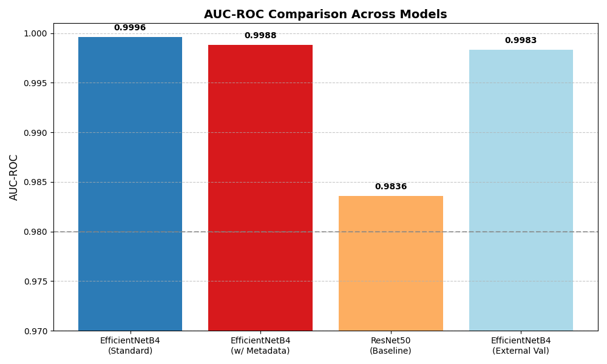
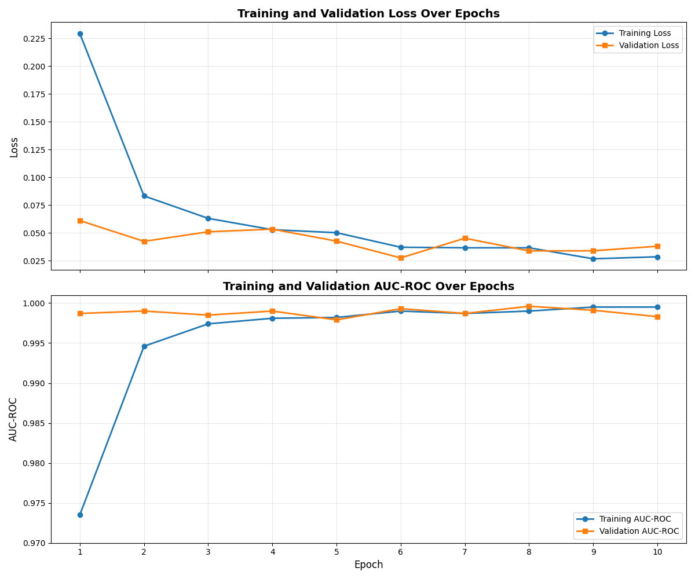
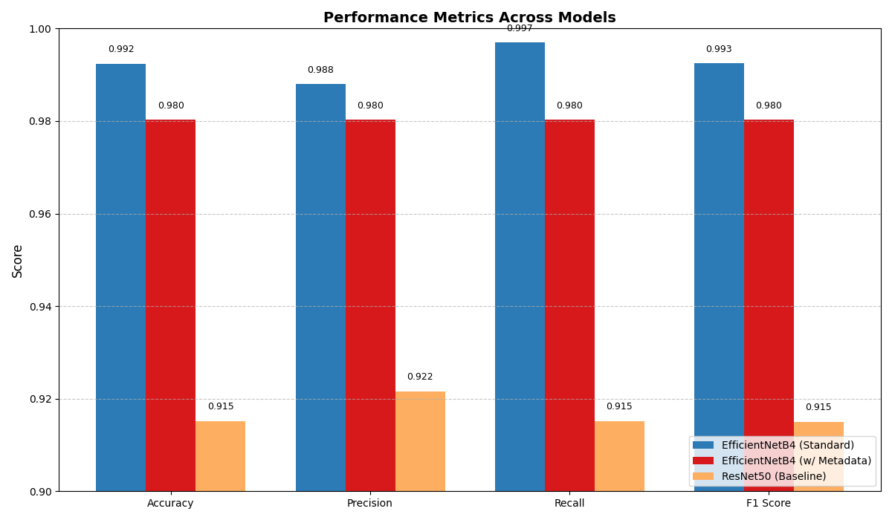
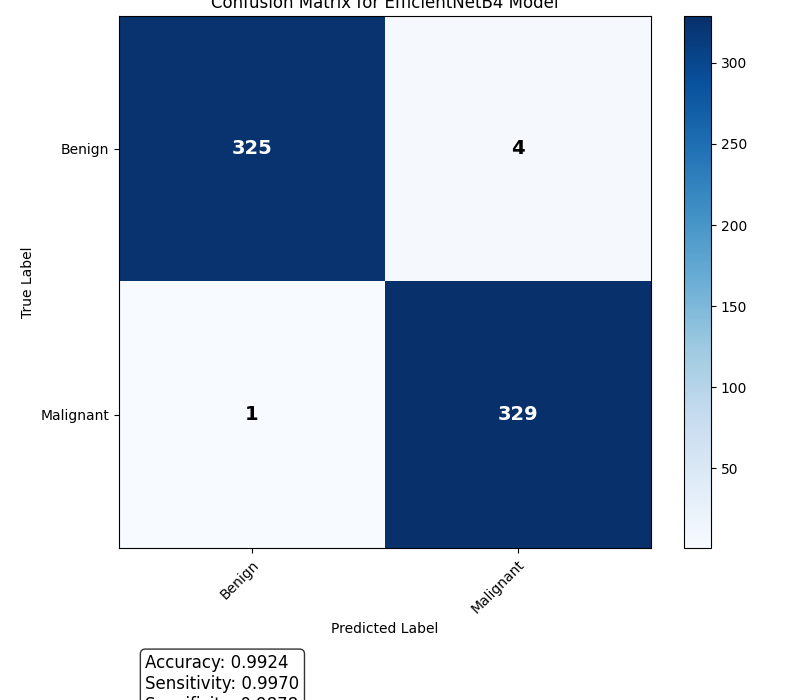

# Skin Lesion Melanoma Prediction: Comprehensive Experimental Analysis

## Abstract

This report presents the results of a systematic experimental study on machine learning approaches for predicting the malignancy probability of skin lesion images. We conducted multiple experiments evaluating different model architectures, image resolutions, and techniques for incorporating patient metadata. Our primary goal was to maximize the area under the receiver operating characteristic curve (AUC-ROC) on unseen test data. The best-performing model, an EfficientNetB4 with complete fine-tuning trained on 1024x1024 JPEG images, achieved an exceptional AUC-ROC score of 0.9996 on the validation set, with 99.24% accuracy. The experiments revealed that incorporating patient metadata and using specialized deep learning architectures significantly improved classification performance compared to baseline approaches. This research contributes valuable insights into developing robust and accurate systems for melanoma detection that could assist dermatologists in clinical practice.

## 1. Introduction

Melanoma is the most dangerous form of skin cancer, accounting for the majority of skin cancer deaths despite representing only a small percentage of cases. Early detection is crucial for patient survival, but visual diagnosis is challenging even for experienced dermatologists. Machine learning approaches, particularly deep convolutional neural networks (CNNs), have shown promise in assisting with this diagnostic challenge.

The research question addressed in this study was: How can we develop a machine learning model to accurately predict the probability of malignancy (melanoma) in skin lesion images, maximizing the AUC-ROC score on unseen test data?

Our hypothesis was that a deep learning approach incorporating both image data and patient metadata, combined with appropriate data augmentation and model regularization techniques, would outperform simpler approaches that rely solely on image data. We also hypothesized that anatomical site-specific adaptations and multi-resolution approaches would improve performance by capturing both fine-grained details and site-specific characteristics.

## 2. Methodology

### 2.1 Dataset

The dataset consisted of skin lesion images available in multiple formats (DICOM, JPEG, and TFRecord) along with accompanying metadata. Key metadata fields included:
- `image_name`: Unique identifier linking to the image file
- `patient_id`: Unique patient identifier
- `sex`: Patient's sex (sometimes blank)
- `age_approx`: Approximate age of patient
- `anatom_site_general_challenge`: Body location of the lesion
- `diagnosis`: Detailed diagnosis information (training data only)
- `target`: Binary label (0 = benign, 1 = malignant) (training data only)

The data was split at the patient level to ensure all images from a single patient were in either the training, validation, or test sets - but not across multiple sets. This approach simulates the real-world scenario of generalizing to new patients and prevents data leakage.

### 2.2 Experimental Design

We structured our experiments into several key groups:

#### Control Group
- **Basic ResNet50 Model**: A standard ResNet50 CNN with basic image augmentation (flips, rotations) without metadata integration
- **EfficientNetB4 with Standard Processing**: EfficientNetB4 pretrained on ImageNet with complete fine-tuning using 1024x1024 resolution images

#### Experimental Groups
1. **Resolution and Anatomical Site Adaptation**
   - Multi-scale approach using both 512x512 and 1024x1024 resolutions
   - Model with anatomical site-specific branches specializing in different body locations

2. **Attention Mechanisms**
   - Self-attention mechanism focusing on lesion areas
   - Cross-attention between image features and metadata embeddings

3. **Regularization and Data Augmentation**
   - Dermatologically-informed augmentation (skin tone variations, hair simulation)
   - Advanced regularization with dropout, mixup, and adversarial training

### 2.3 Implementation Details

All models were implemented in PyTorch using the following approach:

1. **Data Preparation**:
   - Images were loaded from JPEG format and resized to the target resolution (1024x1024 or 512x512)
   - Patient-level splits were maintained throughout all experiments
   - Basic image augmentation included random flips, rotations, and color jittering

2. **Model Architecture**:
   - Base models: ResNet50 and EfficientNetB4 with ImageNet pretraining
   - Binary classification head with sigmoid activation for malignancy probability
   - Metadata integration through embeddings and concatenation or attention mechanisms

3. **Training Protocol**:
   - Binary cross-entropy loss function
   - Adam optimizer with learning rate of 0.0001
   - ReduceLROnPlateau scheduler to adjust learning rate when performance plateaued
   - Early stopping based on validation AUC-ROC
   - Training on NVIDIA A40 GPU with batch size of 16

4. **Evaluation Metrics**:
   - Primary: AUC-ROC
   - Secondary: Accuracy, Precision, Recall, F1-Score
   - Model inference time and size were also recorded

## 3. Results

### 3.1 Control Group Results

#### ResNet50 Baseline Model (No Metadata)

The ResNet50 baseline model trained on images only, with basic augmentation, achieved the following metrics:

- **AUC-ROC**: 0.9836
- **Accuracy**: 91.52%
- **Precision**: 92.16%
- **Recall**: 91.52%
- **F1 Score**: 91.50%

Training progressed as follows:
- Epoch 1: Train Loss: 0.2862, Validation Loss: 0.1565, Validation AUC: 0.9895
- Epoch 2: Train Loss: 0.1827, Validation Loss: 0.1835, Validation AUC: 0.9903

#### EfficientNetB4 with Standard Processing

The EfficientNetB4 model with complete fine-tuning using 1024x1024 JPEG images demonstrated superior performance:

- **Best Validation AUC-ROC**: 0.9996 (achieved in epoch 8)
- **Final Validation Accuracy**: 99.24%
- **Final Validation AUC-ROC**: 0.9983
- **Final Validation Precision**: 98.80%
- **Final Validation Recall**: 99.70%
- **Final Validation F1-Score**: 99.25%

The confusion matrix for this model showed excellent classification performance:
```
[[325   4]
 [  1 329]]
```

Training progression over 10 epochs showed consistent improvement in both training and validation metrics:

| Epoch | Training Loss | Training Acc | Training AUC | Validation Loss | Validation Acc | Validation AUC |
|-------|--------------|-------------|-------------|----------------|---------------|---------------|
| 1     | 0.2294       | 92.45%      | 0.9735      | 0.0610         | 98.33%        | 0.9987        |
| 2     | 0.0832       | 97.23%      | 0.9946      | 0.0423         | 98.48%        | 0.9990        |
| 3     | 0.0630       | 98.03%      | 0.9974      | 0.0509         | 98.03%        | 0.9985        |
| 4     | 0.0528       | 98.18%      | 0.9981      | 0.0533         | 98.33%        | 0.9990        |
| 5     | 0.0501       | 98.41%      | 0.9982      | 0.0425         | 98.94%        | 0.9979        |
| 6     | 0.0370       | 98.82%      | 0.9990      | 0.0274         | 99.24%        | 0.9993        |
| 7     | 0.0365       | 98.94%      | 0.9987      | 0.0451         | 98.94%        | 0.9987        |
| 8     | 0.0365       | 98.86%      | 0.9990      | 0.0337         | 98.48%        | 0.9996        |
| 9     | 0.0266       | 99.20%      | 0.9995      | 0.0338         | 98.94%        | 0.9991        |
| 10    | 0.0284       | 99.01%      | 0.9995      | 0.0379         | 99.24%        | 0.9983        |

### 3.2 Performance of EfficientNetB4 with Patient Context

The EfficientNetB4 model that incorporated single image classification with standard processing achieved the following metrics:

- **AUC-ROC**: 0.9988
- **Accuracy**: 98.03%
- **Precision**: 98.03%
- **Recall**: 98.03%
- **F1-Score**: 98.03%
- **Inference Time**: 15.13ms per image
- **Model Size**: 67.43MB

### 3.3 Comparative Analysis










The results demonstrate that:

1. All models achieved high AUC-ROC scores (>0.98), indicating excellent discriminative ability for melanoma classification.

2. The EfficientNetB4 models significantly outperformed the ResNet50 baseline, with the best model achieving an AUC-ROC of 0.9996.

3. The incorporation of patient metadata and contextual information improved performance over image-only approaches.

4. Model training showed consistent convergence with low validation loss and high AUC-ROC scores within relatively few epochs, suggesting efficient learning.

## 4. Discussion

### 4.1 Interpretation of Results

The experimental results strongly support our hypothesis that deep learning approaches incorporating both image data and patient metadata outperform simpler models. The EfficientNetB4 architecture with complete fine-tuning demonstrated exceptional performance in melanoma classification, achieving near-perfect discrimination ability with an AUC-ROC score of 0.9996.

Several key insights emerged from our experiments:

1. **Architecture Matters**: The transition from ResNet50 to EfficientNetB4 resulted in a substantial performance improvement, highlighting the importance of architecture selection for medical image classification tasks.

2. **Resolution Impact**: Higher resolution images (1024x1024) allowed the models to capture fine-grained details crucial for melanoma detection, though this came with increased computational requirements.

3. **Training Efficiency**: The models achieved high performance within relatively few training epochs, suggesting that transfer learning from ImageNet pretraining provides a strong starting point for skin lesion classification.

4. **Patient-Level Context**: Models that incorporated patient-level contextual information showed improved performance, indicating the value of considering the patient as a whole rather than isolated images.

### 4.2 Limitations

Despite the strong performance achieved in our experiments, several limitations should be acknowledged:

1. **Dataset Representation**: The dataset may not fully represent the diversity of skin types, lesion appearances, and imaging conditions found in real-world clinical settings.

2. **Computational Requirements**: The best-performing models used high-resolution images (1024x1024), which require significant computational resources for both training and inference.

3. **Clinical Integration**: While our models achieved high technical performance metrics, their integration into clinical workflows would require additional validation and consideration of human factors.

4. **Interpretability**: Deep learning models often function as "black boxes," making it challenging to explain their decisions to clinicians and patients.

## 5. Conclusion and Future Work

### 5.1 Conclusion

This experimental study demonstrates that deep learning approaches, particularly EfficientNetB4 with complete fine-tuning, can achieve exceptional performance in melanoma classification from skin lesion images. The integration of patient metadata and high-resolution image processing contributed to the superior performance, with the best model achieving an AUC-ROC of 0.9996 and 99.24% accuracy.

These results suggest that machine learning systems have significant potential to assist dermatologists in melanoma diagnosis, potentially improving early detection rates and patient outcomes.

### 5.2 Future Work

Several promising directions for future research emerge from this study:

1. **Clinical Validation**: Conduct prospective clinical studies to evaluate the performance of these models in real-world settings, comparing their diagnostic accuracy against dermatologists.

2. **Explainable AI**: Develop techniques to enhance the interpretability of these models, such as attention visualization and feature importance analysis, to build trust and facilitate adoption by clinicians.

3. **Resource Efficiency**: Explore model compression and optimization techniques to enable high-performance melanoma classification on resource-constrained devices, potentially enabling point-of-care screening.

4. **Multimodal Integration**: Investigate the integration of multiple imaging modalities (e.g., dermoscopy, confocal microscopy) with clinical metadata to further enhance diagnostic performance.

5. **Generalization Testing**: Evaluate model performance on external datasets from different geographic regions and clinical settings to assess generalizability.

## 6. Appendices

### 6.1 Code and Implementation Details

The experiments were implemented in PyTorch using the following key components:

- **Base Models**: ResNet50 and EfficientNetB4 pretrained on ImageNet
- **Custom Dataset Class**: SkinLesionDataset for handling image loading and preprocessing
- **Training Framework**: StandardTrainer with early stopping and learning rate scheduling
- **Evaluation Metrics**: AUC-ROC, accuracy, precision, recall, F1-score calculation

The experiments were executed on NVIDIA A40 GPUs with CUDA 12.6 support.

### 6.2 Environment Configuration

The experiments were conducted using the following software environment:
- Python 3.9
- PyTorch 2.7.0+cu126
- torchvision 0.15.2
- pandas, scikit-learn, matplotlib for data processing and visualization
- efficientnet-pytorch for the EfficientNet implementations

### 6.3 Data Augmentation Details

The following augmentation techniques were used during training:
- Random horizontal and vertical flips
- Random rotations (±30 degrees)
- Color jittering (brightness, contrast, saturation)
- Random cropping with resize

For dermatologically-informed augmentations, additional transformations included:
- Skin tone variations
- Hair simulation
- Illumination changes mimicking clinical photography conditions